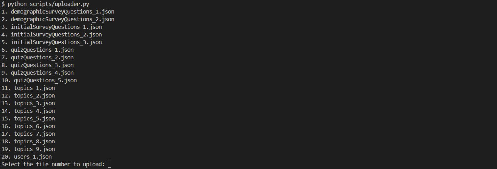

# Cyber Tutor Firestore Data Dumping

## Usage

```bash
python scripts/downloader.py
```


```bash
python scripts/uploader.py
```



## Local Instance Instructions

1. Open Visual Studio Code
2. Open a new terminal, and clone this GitHub repository using the following command:

```powershell
git clone https://github.com/Cyber-Tutor/Cyber-Tutor-Firestore-Data-Dumping.git
```

3. Create and activate a Python virtual environment using the following commands:

```powershell
python -m venv .venv
.venv\Scripts\activate
```

4. Install packages from requirements.txt using the following command:

```powershell
pip install -r requirements.txt
```

5. Get the serviceAccountKey.json from Firestore, and the commands should work. The `serviceAccountKey.json.template` should help you know if you downloaded the correct file.
